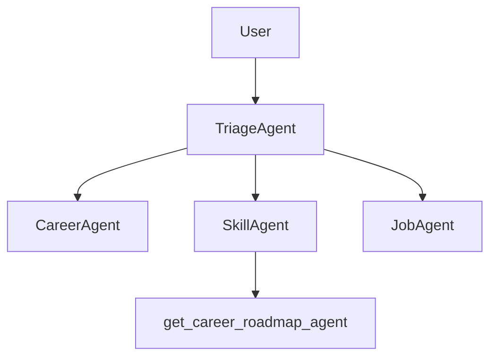

# 🎓 Career Mentor Agent

A multi-agent career assistant that helps users explore career options, develop skills, and understand job roles using intelligent handoff logic.

## 🚀 What It Does

- Suggests relevant **career paths** based on user interests.
- Recommends **skills** to build in that career using a tool-based agent.
- Explains **job roles**, responsibilities, salary expectations, and more.
- Dynamically hands off control between specialized agents based on user input.

---

## 🧠 How It Works

### Agents & Tools:

- **TriageAgent** (Main agent):

  - Routes the conversation based on user intent.
  - Uses handoff logic to delegate to:
    - `CareerAgent` – suggests career paths.
    - `SkillAgent` – suggests skills via tool.
    - `JobAgent` – describes job roles.

- **SkillAgent**:

  - Uses a **tool**: `get_career_roadmap_agent` to fetch learning roadmaps for careers.

- **JobAgent**:

  - Directly responds to job-related queries.

- **CareerAgent**:
  - Provides personalized career guidance.

---

### 🧩 Agent Handoff Logic

